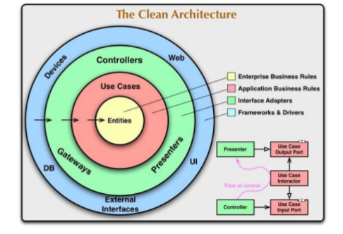

# Clean Architecture Book

1. [ ] [Chapter 1 What Is Design and Architecture?](Chapter-1-What-Is-Design-and-Architecture.md)

22. [ ] [Chapter 22 The Clean Architecture](Chapter-22-The-Clean-Architecture.md)
23. [ ] [Chapter 23 Presenters and Humble Objects](Chapter-23-Presenters-and-Humble-Objects.md)
24. [ ] [Chapter 24 Partial Boundaries](Chapter-24-Partial-Boundaries.md)
25. [ ] [Chapter 25 Layers and Boundaries](Chapter-25-Layers-and-Boundaries.md)

### Resumo
----------

Uma Arquitetura de um sistema bem estruturado deve dizer a intenção do Sistema e não a Tecnologia que o sistema está usando.

**Exemplos do Uncle Bob:**

> Quando olhamos para a arquitetura/estrutura de uma biblioteca, sabemos para qual propósito ela foi criada porque podemos porque podemos ver as estantes de livros, mesas e cadeiras, tudo está dizendo o propósito para que foi criada, ao olharmos para a arquitetura não nos preocupamos com o que foi usado para chegar aquele ponto.

> O mesmo ocorre para a arquitetura de uma igreja, a arquitetura/estrutura praticamente grita para qual próposito tudo aquilo foi criado.

Isso deve acontecer com a arquitera de um sistema, ao olharmos devemos ver o propósito para o qual foi criado e não as tecnologias.   
Exemplo: não devemos olhar para uma arquitetura e vermos uma estrutura de um Framework especifico tipo Spring, Rails, Maven e etc...

Em uma Arquiterua Limpa os detalhes de Tecnologia deve estar nas partes mais externas da Arquitetura, a parte Web por exemplo deve ser visto como um IO Device e o Core da aplicação nem deve saber que existe uma Device Web ou Mobile...

Uma Arquitetura Limpa deve ter algumas caracteristicas:

- Deve ser independente de framework ou bibliotecas

A arquitetura não deve depender de uma tecnologia especifica, de modo que, se precisar por exemplo trocar o Banco de Dados, a tecnologia MVC ou o sistema de mensageria o Core da aplicação não sofra nenhum impacto, porque o sistema é facilmenete alterável.

- A Arquiterua deve Testável

Deve ser possivel testar a regra de negócio de forma isolada da Tecnologia.

- A Arquiterua deve ser independente de Banco de Dados

O Banco de Dados deve ser um detalhe do sistema.

- A Arquitetura deve ser independente da interface gráfica.

Podemos começar por exemplo como Web e trocar para uma interface Mobile sem afetar o Core do sistema.

### Camadas
--------------

- Entities
- Use Cases
- Interface Adapters
- Frameworks & Drivers

**Entities**

As classes de Dominio, o Core do sistema com as Rregra de negócio, coisas que existiriam independente das coisas que automatizam o processo.

**Use Cases**

São as operações do sistema e como será automatizado o processo, aqui fica as regras de negócio da Aplicação que são **Dependentes** do **Dominio**

**Interface Adapters**

Controllers, Gateways(exemplo ORM), Presenters(Inputs, Outputs) 

**Frameworks & Drivers**

Interfaces Externas: UI, DB, Intergrações, Mensagerias

### Comunicação
---------------

A comunicação deve ser sempre da camada Externa para a interna, nunca o contrário.

Frameworks & Drivers podem se comunicar com:   

- Interface Adapters
- Use Cases
- Entities 

Interface Adapters:   

- Use Cases
- Entities

Use Cases:   

- Entities

Entities;

!!! Não deve enchergar nenhuma outra camada !!!

As camadas mais internas deve criar Interfaces que serão implementadas pela camada mais externa

Exemplo:

- Entities cria Interfaces para serem implementadas por Use Case
- Use Case cria Interfaces para serem implementadas por Adapters
 

Em uma Arquitetura Limpa não deve apresentar os Sintomas de um Sistema Podre,
Quando o Sistema está Prodre, ele tende a ser:

- **Frágil** - de maneira que quando você altera uma parte do sistema pode dar problema em outra, e isso está muito ligado ao acoplamento que tentamos eliminar com a Arquitetura Limpa.
- **Rígido** - quando precisa alterar uma coisa o sistema te obriga a alterar outras partes e uma alteração que poderia ser pequena passa a ser grande(Open Closed Principle).
- **Imobilidade** - A questão de reuso, se precisar tirar um módulo para usar em outro sistema não será possivel.
- **Viscosidade** - Quando a mudança mais fácil é a Gambiarra porque a mudança correta vai causar muito esforço.  

