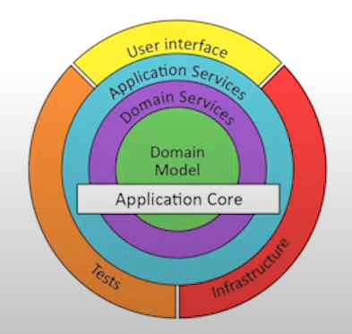

# Clean Architecture References

Referencias de palestras e artigos sobre Clean Architecture

**Modelos de Arquitetura dentro da Clean Architecture**   

- [Ports and Adapter / Hexagonal Architecture - 2005 (Dr. Alistair Cockburn)](#ports-and-adapter-ou-hexagonal-architecture)
- [Onion Architecture - 2008  (Jeffrey Palermo)](#onion-architecture)
- [Architecture - 2017 (Robert C. Martin aka Uncle Bob others SOLID, Clean Code)](#clean-architecture)

### Ports and Adapter ou Hexagonal Architecture   

### Onion Architecture   

### Clean Architecture   

### Uncle Bob's Idea
--------------------

- **Interactor**: Boundary/UseCase
- **EntityGateway**: PortInterface
- **EntityGatewayImplementation**: AdapterImplementation
- **Boundary**: UseCaseInterface

### The Onion/Hexagonal Architecture
------------------------------------

### The Onion Approach
----------------------

> Nessa abordagem o importate é que o UseCase fica isolado e protegendo as Entdades/Dominio
> Se a Persistencia vai ser no Banco X ou Y o UseCase e Domain não precisão saber, e se precisar trocar de Banco quem consome os dados não será afetado.
> Se será exposto por uma API Rest, um MVC, Jobs, Queue... O UseCase/Domain não sabe, e se vai usar Spring ou qualquer outro Framework não importa para o UseCase/Domain.
> Assim podemos testar e estressar os UseCases colocando um Mock/Fake como Persistencia, e quando chegar o momento escolhemos o tipo de persistencia isoladamente.
> O mesmo acontece com a escolha de Framework para REST, MVC, etc...

:warning: Essa abordagem pode ser considerada um **OverEngineering** e ficar dificil de manter, a menos que o time esteja seguro dos conceitos.

### Clean Arch Good Enough Approach
-----------------------------------

> By Mercado Livre
> O UseCase continua isolado e se tudo ao redor são apenas detalhes, podem ficar em uma camada externa apenas
> Assim teria um package de **Application** e outro de **Domain**

- **domain/dataprovider**: são as abstrações/interfaces (like Gateway Uncle Bob's Approach) que são implementadas na camada de **application/dataprovider**
- O mesmo acontece com os **application/entrypoint** que ficam isolados e suas implementações não comprometem os UseCases/Domain
- Podemos ter **SubDomains** dentro de **Domain** exemplo: Order, Invoice, Seller, Payment...
- O importante é que as Entidades de SubDomain não se conheçam, e toda comunicação deve ser por fora, usando uma **Facade** para fazer as Invokes dos **UseCases**, assim mantemos nossos **Boundaries Contexts**.

:information_source: As classes de UseCase não precisam estar sujas com o Framework, por exemplo o Spring, se usarmos a especificação `@Named` o Spring consegue identificar como um `Bean` durante o Scan e Fazer o `Inject`. 

:bell: Neste modelo do lado do **Domain** fazemos apenas **Testes Unitários** e do lado de **Application** fazemos apenas **Testes Integrados**

### Arquitetura Hexagonal: O que você precisa saber
---------------------------------------------------

- Domain: Testes Unitário são baratos
- Application: Testes de Integração com escopos claros
- Adapters: Testes com mundo externo por ser Mockado

 
 

