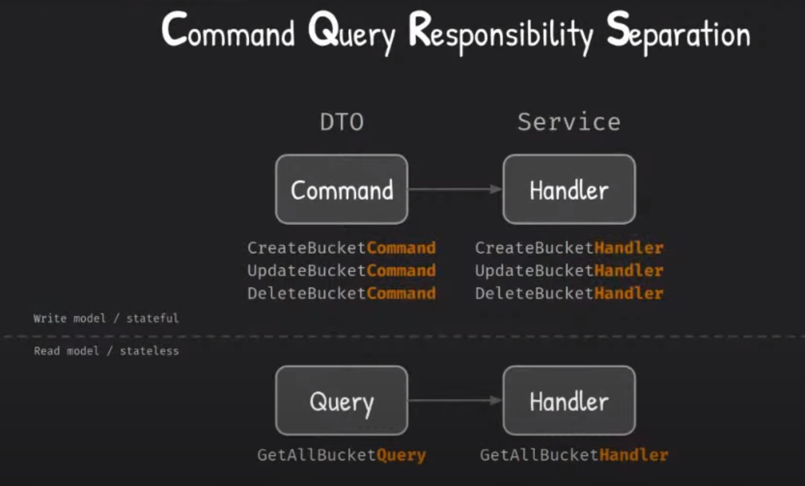

# CQRS - Command Query Responsibility Separation

### Classes Name Example

**References**

- [CQRS: Além das aparências by Mario Resende at SouJava Youtube](https://www.youtube.com/watch?v=27jgPvvD0OQ) 